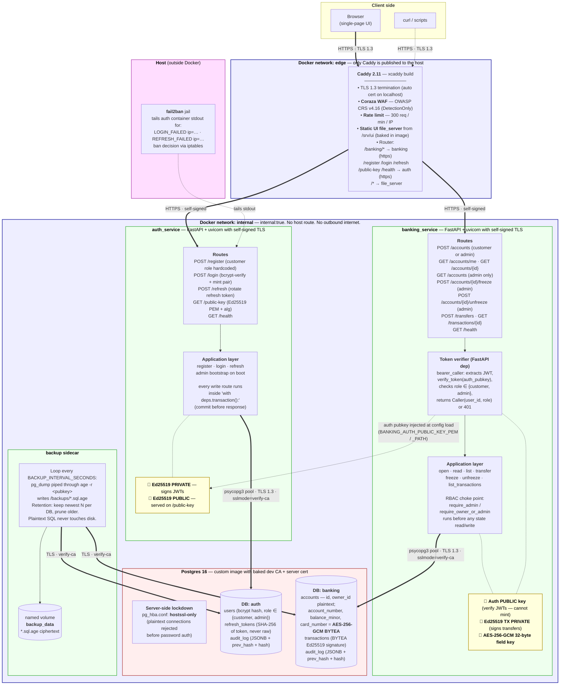
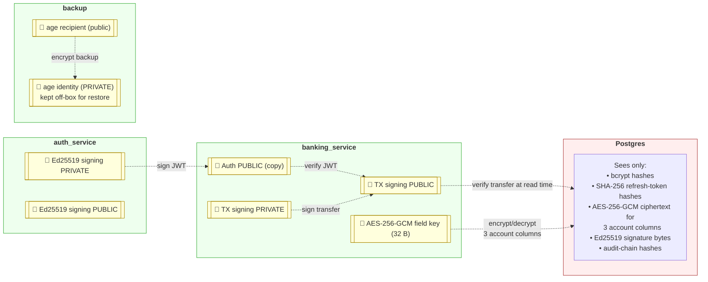
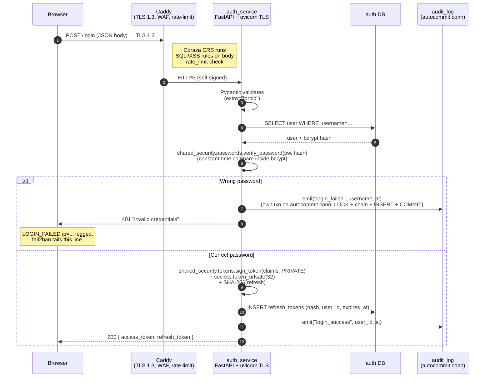
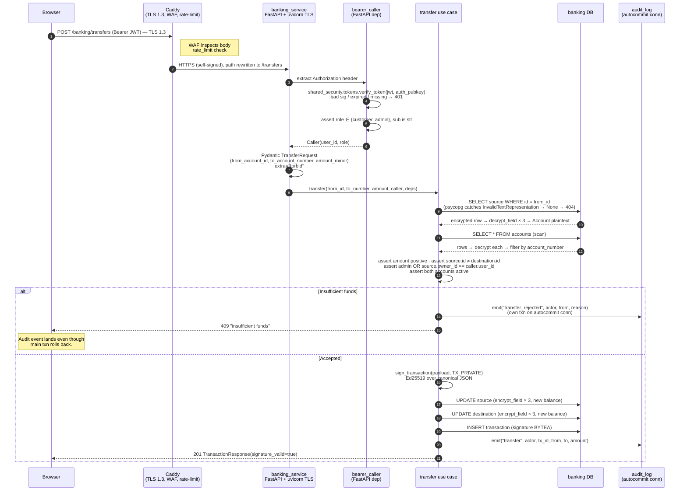
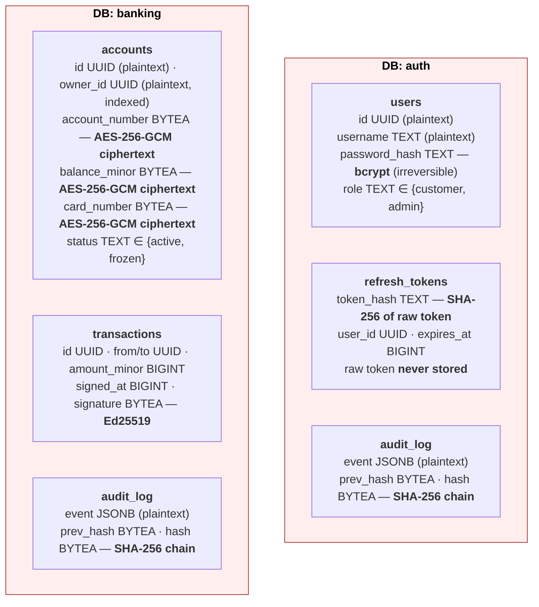
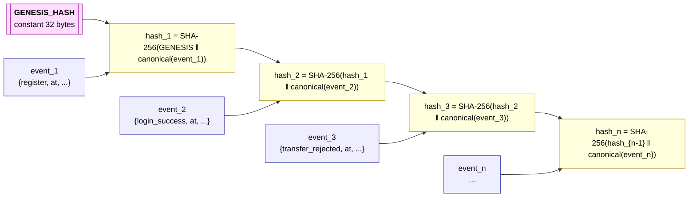

# The whole system, in diagrams

One page for the lazy reviewer. Every security control marked on a picture, with the code that implements it linked underneath. If this is the only page you read, you should still leave knowing what defends what, where every key lives, and how the request path is protected end to end.

Legend for every diagram on this page:

- **Solid arrow** — request / data flow.
- **Double arrow (==)** — encrypted transport (TLS).
- **Dotted arrow (-.-)** — configuration / trust relationship, not runtime traffic.
- **🔑** — key material owned by that box (private = the box can sign / decrypt; public = the box can only verify).
- **Yellow box** — key or crypto artefact. **Green box** — service. **Red box** — persistent storage. **Blue box** — network boundary.

---

## 1. Deployment topology — one page, everything

Every container, every network, every published or non-published port, every crypto choke point.

**What this picture proves.** Every arrow crossing a network boundary is encrypted. Only Caddy has a published port. Postgres refuses plaintext at the pg_hba layer, so a mis-configured container cannot accidentally connect insecurely. Backups leave the DB via TLS, become ciphertext before hitting disk. Auth is the only container with the JWT signing key; every other service can only verify.

---

## 2. Trust boundaries — who holds what key, who can do what

The interesting cryptographic property is *asymmetric trust*. Banking cannot forge tokens. Postgres cannot forge signed transfers. A stolen DB dump cannot read account numbers.

Table form for the same picture — the "who can do what" matrix:

| Actor | Can mint JWTs | Can verify JWTs | Can sign transfers | Can verify transfers | Can decrypt account fields | Can decrypt a backup |
|-------|---------------|-----------------|--------------------|----------------------|----------------------------|----------------------|
| auth_service | ✅ has private key | ✅ | ❌ | ❌ | ❌ | ❌ |
| banking_service | ❌ | ✅ has public key only | ✅ has private key | ✅ | ✅ has field key | ❌ |
| Postgres | ❌ | ❌ | ❌ | ❌ | ❌ | ❌ |
| Attacker with DB dump | ❌ | ❌ | ❌ | ❌ | ❌ | ❌ |
| Attacker with backup file | ❌ | ❌ | ❌ | ❌ | ❌ | ❌ (needs age identity) |

**Consequence:** compromising Postgres alone doesn't get you cleartext accounts, valid tokens, or valid transactions. You need the running banking container's memory to get the field key and the TX private key.

---

## 3. What a request actually does — login (the auth path)

**Security payload of this diagram, top to bottom:**

- **Step 1**: TLS 1.3 in the browser lock icon — no plaintext at any point.
- **Step 2**: OWASP CRS inspects the body before FastAPI sees it.
- **Step 3**: uvicorn on the service listens on HTTPS with its own cert; Caddy dials it over TLS.
- **Step 4**: Pydantic's `extra="forbid"` means a client cannot smuggle `{"role":"admin"}` into `/register`. See [../03-auth-service/input-validation.md](../03-auth-service/input-validation.md).
- **Step 6**: bcrypt at cost factor 12; even a DB dump doesn't yield cleartext passwords.
- **Failure branch**: the audit event lands on a **separate autocommit connection** so it survives the request rollback. This is the "two-connection audit durability" pattern. See [../03-auth-service/audit-log-durability.md](../03-auth-service/audit-log-durability.md).
- **Success branch**: raw refresh token leaves once; the DB sees only SHA-256(token). A refresh-token DB leak yields nothing usable.

---

## 4. What a request actually does — transfer (the banking path)

The most crypto-dense flow. Signature, field encryption, RBAC, audit — all in one call.

**On a later read** (`GET /transactions/{account_id}`) every row is re-verified with `verify_transaction(payload, signature, TX_PUBLIC)` and returned with `signature_valid: bool`. If the DB was tampered directly (`UPDATE transactions SET amount_minor=999`), the flag flips to `false` on the very next read — the tamper is *visible*, not hidden.

Full flow with rules-in-order: [../07-banking-service/flow-transfer.md](../07-banking-service/flow-transfer.md).

---

## 5. Storage layout — what's plaintext, what's ciphertext, what's hashed

The single most-asked reviewer question is "what would an attacker with the DB see". This diagram answers it.

**What the DB dump gives an attacker, per column:**

| Column | Format | What the attacker gets |
|--------|--------|------------------------|
| `users.password_hash` | bcrypt (cost 12) | Nothing usable — must brute-force per user |
| `refresh_tokens.token_hash` | SHA-256 | Nothing — raw token never stored |
| `accounts.account_number` | AES-256-GCM ciphertext | Nothing — needs the field key |
| `accounts.balance_minor` | AES-256-GCM ciphertext of `str(int)` | Nothing — same key |
| `accounts.card_number` | AES-256-GCM ciphertext | Nothing — same key |
| `accounts.owner_id` | UUID plaintext | Which auth user owns which internal account id (opaque UUID pair). Documented trade-off — foreign-key filtering vs full opacity. |
| `transactions.amount_minor` | Plaintext | Visible, but tampering flips `signature_valid` to `false` on next read. |
| `transactions.signature` | 64 bytes | Nothing without the TX private key. |
| `audit_log.event` | Plaintext JSONB | Timeline of who did what. Tampering breaks the SHA-256 chain. |
| `audit_log.hash` | 32 bytes | The chain tip. Verifiable with `verify_chain`. |

**Encryption at rest is column-level, not disk-level.** A `docker exec postgres cat /var/lib/postgresql/data/base/…` would still yield ciphertext for the encrypted columns. Disk-level encryption is a separate concern (host FS, not app-layer).

---

## 6. The audit chain — why tampering is visible

Both `auth.audit_log` and `banking.audit_log` are hash-chained. Same primitive, two independent tables.

**Two subtle mechanics protect this against races and rollbacks:**

- **Writes go through a separate autocommit connection.** The main request transaction can roll back (failed login, insufficient funds); the audit event is already committed. See [../03-auth-service/audit-log-durability.md](../03-auth-service/audit-log-durability.md).
- **`LOCK TABLE audit_log IN SHARE ROW EXCLUSIVE MODE`** at the start of every write. Two concurrent writers cannot interleave `SELECT last hash → compute → INSERT` and fork the chain.

**Detection.** `shared_security.audit_chain.verify_chain(rows)` recomputes every hash from the first event forward. Any mismatch → `False`. Demonstrable live by editing a random row's `event` column and running the check.

---

## 7. What each assignment security point maps to on these diagrams

The lazy-reviewer cheat sheet. Every graded control, where it appears, tested by what.

| # | Control | Where on the diagrams | Code | Test |
|---|---------|-----------------------|------|------|
| 1 | TLS 1.3 client→proxy | §1 · Browser ⇒ Caddy | {{ src("proxy/caddy/Caddyfile") }} | manual browser lock icon |
| 2 | Network isolation | §1 · <code>internal: true</code> label | {{ src("deploy/compose/docker-compose.yml") }} | `docker network inspect` |
| 3 | WAF | §1 · Caddy box | {{ src("proxy/coraza/coraza.conf") }} | SQLi curl → CRS log |
| 4 | HTTPS proxy→services | §1 · Caddy == HTTPS ==> auth/banking | {{ src("auth_service/Dockerfile") }} + Caddy `tls_insecure_skip_verify` | smoke |
| 5 | Password hashing | §5 · users.password_hash column | {{ src("shared_security/src/shared_security/passwords.py") }} | {{ src("auth_service/tests/test_login.py") }} |
| 5 | Token signing | §2 · Ed25519 private key in auth only | {{ src("shared_security/src/shared_security/tokens.py") }} | {{ src("shared_security/tests/test_tokens.py") }} |
| 6 | RBAC customer vs admin | §1 · BankCore box · authz choke point | {{ src("banking_service/src/banking_service/application/authz.py") }} | {{ src("banking_service/tests/test_freeze_account.py") }} etc. |
| 7 | Token verify + field enc + tx sign | §4 · full transfer sequence | {{ src("banking_service/src/banking_service/application/transfer.py") }} | {{ src("banking_service/tests/test_transfer.py") }} |
| 8 | TLS services→DB | §1 · psycopg pool ==> Postgres | pg_hba + service `sslmode=verify-ca` | `SELECT * FROM pg_stat_ssl` |
| 9 | Encryption at rest for sensitive fields | §5 · accounts BYTEA columns | {{ src("banking_service/src/banking_service/infrastructure/repositories/accounts_repo.py") }} | {{ src("banking_service/tests/test_integration_postgres.py", text="test_sensitive_fields_are_ciphertext_on_disk") }} |
| 10 | Hash-chained audit log | §6 · SHA-256 chain diagram | {{ src("shared_security/src/shared_security/audit_chain.py") }} | {{ src("banking_service/tests/test_integration_postgres.py", text="test_audit_chain_valid_end_to_end") }} |
| 11 | Encrypted backups | §1 · backup sidecar | {{ src("deploy/backup/") }} | manual restore drill |
| 12 | fail2ban IDS | §1 · Host box | {{ src("deploy/fail2ban/") }} | log-line format locked in auth `_client_ip` |

---

## 8. Quick tour for a five-minute skim

If you only have five minutes:

1. Look at diagram §1 — see that only Caddy talks to the outside, and every crossing arrow is encrypted.
2. Look at the trust matrix in §2 — no single container holds every key. Compromising any one gets you a bounded blast radius.
3. Look at the storage layout in §5 — the DB alone reveals nothing sensitive that isn't hashed, encrypted, or signature-protected.
4. Look at the transfer sequence in §4 — see the RBAC check, field-encryption boundary, signature, and audit event all appear in a single call.
5. Look at the audit chain in §6 — every state change is retrospective-evidence-preserving.

If you have another minute, click any {{ src("shared_security/src/shared_security/") }} link — that's the crypto boundary the two services share, tested first (per CLAUDE.md's "test-first on security-critical code").
